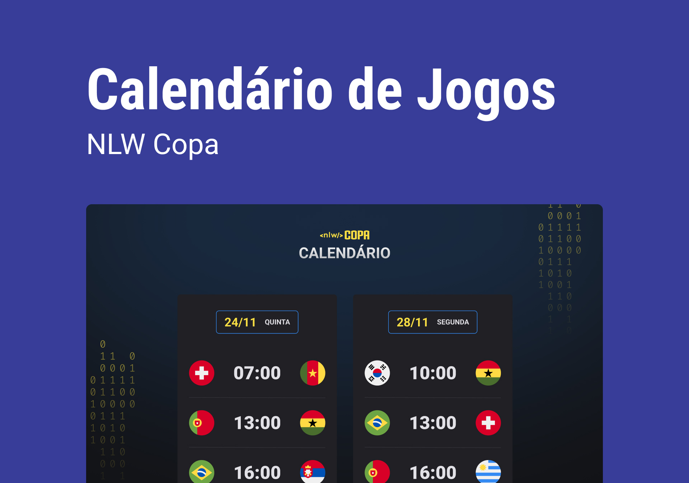

<h1 align="center"> NLW - COPA </h1>

  

 

  

## 🚀 Tecnologias

Esse projeto foi desenvolvido com as seguintes tecnologias:

- HTML e CSS
- JavaScript

## 💻 Projeto

Calendário da Copa do Mundo de Futebol 2022

## 💻 Demonstração

https://Pamplona-C.github.io/nlw-Copa/

## 🔖 Layout

Você pode visualizar o layout do projeto através do [link no Figma](https://www.figma.com/file/01Q1puG6BFnVmHLlYzWuch/Calend%C3%A1rio-de-Jogos-(Community)?node-id=0%3A1). É necessário ter conta no [Figma](https://figma.com) para acessá-lo.

## :memo: Licença

Esse projeto está sob a licença MIT.

---

Feito por mim!